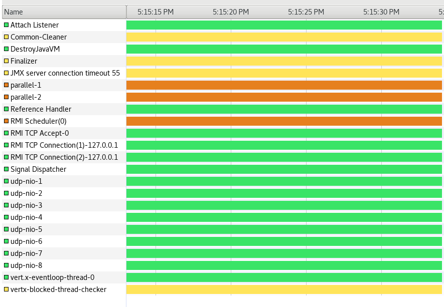

# Vertx + Metrics bug reproducer

In this project I'm trying to use Vertx with Micrometer, more specifically the class `StatsdMeterRegistry`.

When you try to close the application by calling `vertx#close`, you see that the application still hangs.

Even if you try to manually close the `StatsdMeterRegistry`, the application might still hang in many cases (it's pretty random).

When you use `visualvm` to look at the threads that are stuck, you will see the following image:

